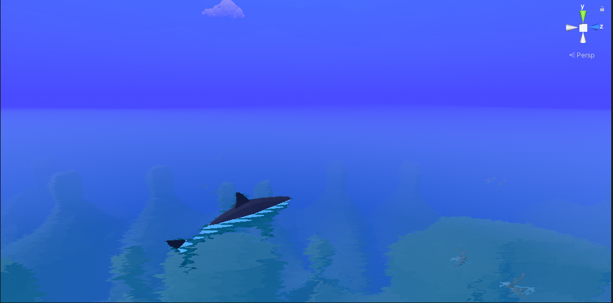
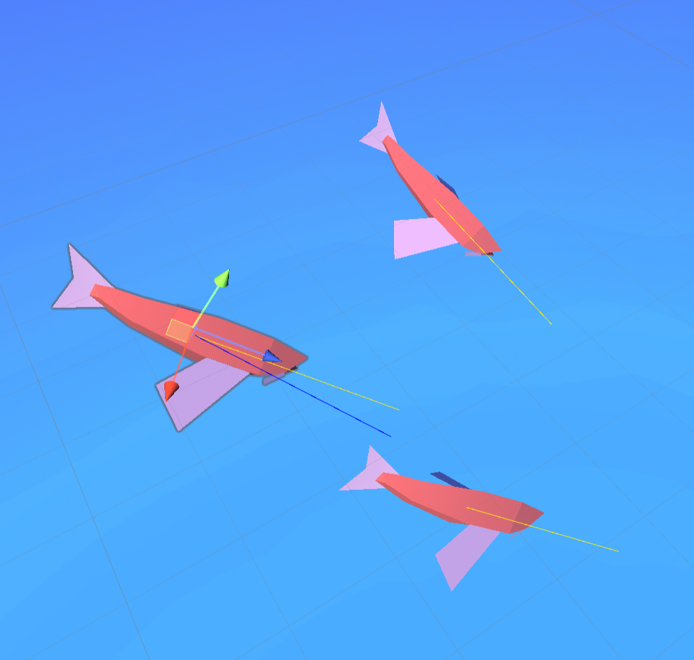
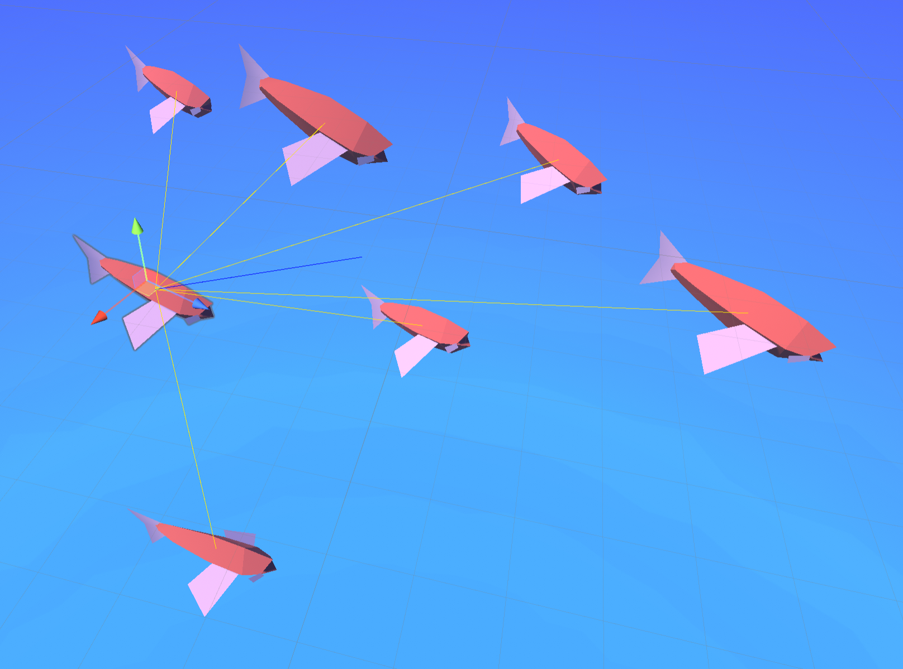
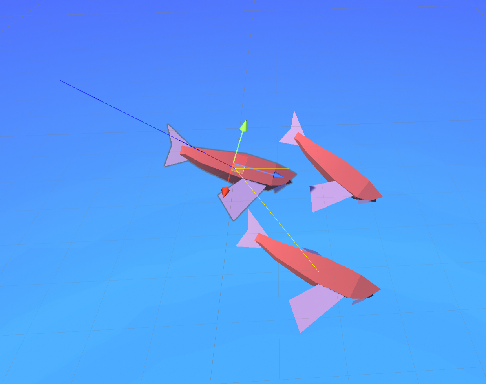
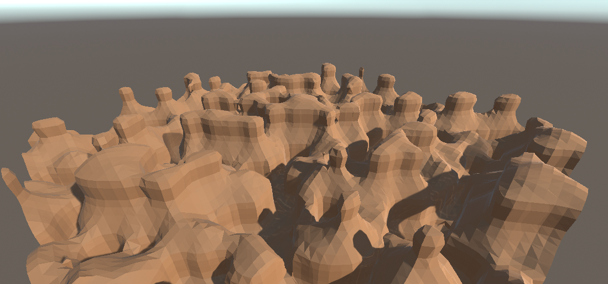
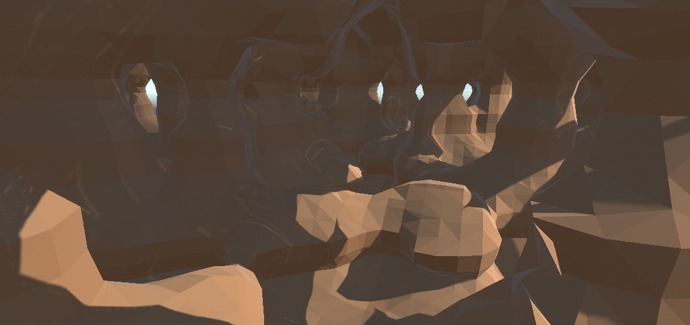
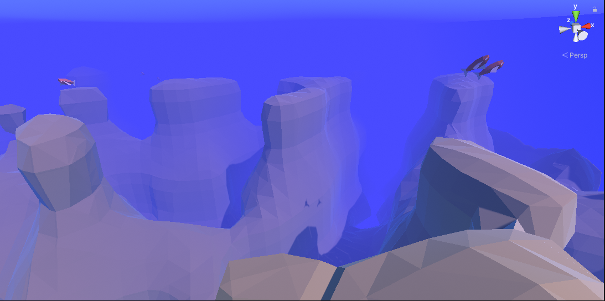
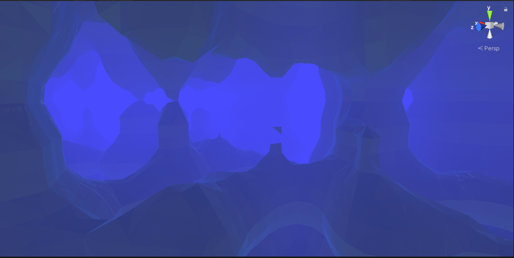

# Underwater Landscape - Group 7

This repository contains our project for the 3rd assignment for the course Modern Game AI and Algorithms and was built by [Matthias Aarnoutse](https://github.com/mattiejas), [Benjamin Havenaar](https://github.com/benjaminhavenaar), [Job Vink](https://github.com/jobvink) and
[Niels Witte](https://github.com/Trottero/)

## Fauna

We've introcued schools of fish which freely swim around in the area. They implement the three boid rules (Alignment, Cohesion, Seperation)

### Alignment

### Cohesion

### Seperation

## Terrain

Terrain is generated using the marching cubes algorithm

Fog is introduced to obfuscate the rendering of new chunks

